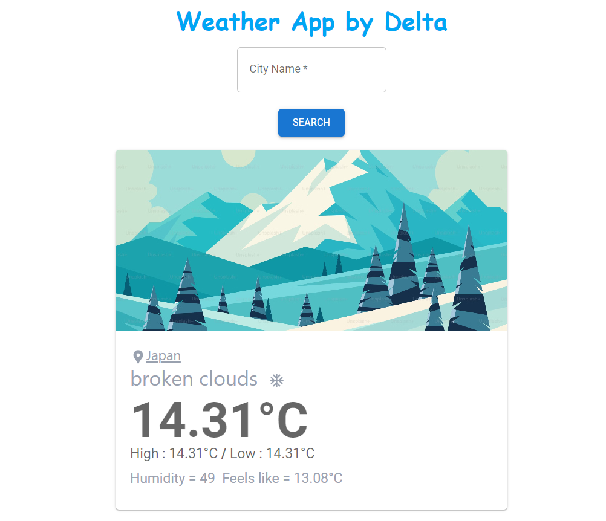

# Weather Widget 🌦️

A simple and responsive **Weather Widget** built with **React + Vite** and styled using **Tailwind CSS**. This project fetches real-time weather data based on user input and displays key weather details.

## 📸 Screenshots



## 🚀 Features

- 🌍 Search for weather by city name
- ☀️ Displays temperature, weather conditions, and humidity
- 🔄 Fetches real-time data from an API
- 🎨 Responsive design using Tailwind CSS
- ⚡ Fast and optimized with Vite

## 🛠️ Technologies Used

- **React.js** – For building the user interface
- **Vite** – Fast and optimized development environment
- **Tailwind CSS** – For styling
- **OpenWeather API** (or another weather API) – For fetching weather data

## 📦 Installation

Clone the repository and install dependencies:

```bash
git clone https://github.com/vikrant-vikrant/Weather-wedget.git
cd Weather-wedget
npm install
```

## 🔑 Setup API Key

Create a `.env` file in the root directory and add your API key:

```bash
VITE_WEATHER_API_KEY=your_api_key_here
```

## 🚀 Running the Project

Start the development server:

```bash
npm run dev
```

## 🏗️ Building for Production

To create an optimized production build, run:

```bash
npm run build
```

## 📬 Contact

If you have any questions or suggestions, feel free to reach out:

- GitHub: [vikrant-vikrant](https://github.com/vikrant-vikrant)
- Email: [vikrant2003vikrant@gmail.com](mailto:vikrant2003vikrant@gmail.com)
